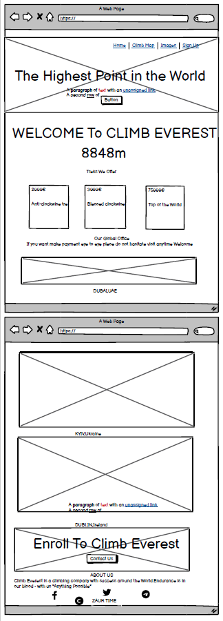
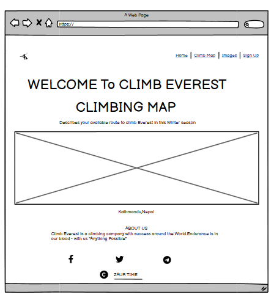
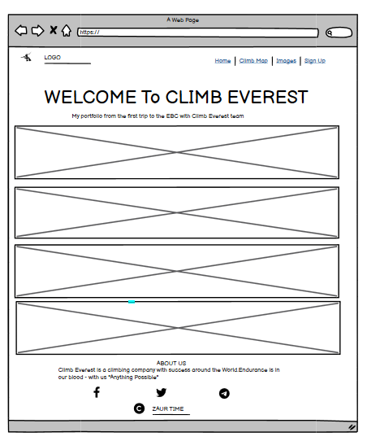
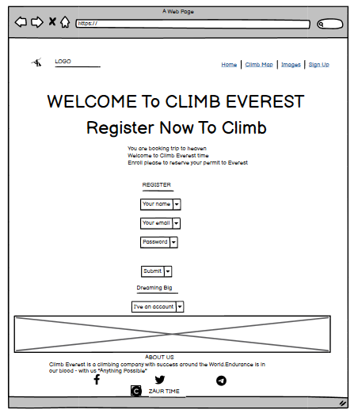
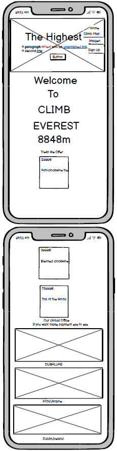
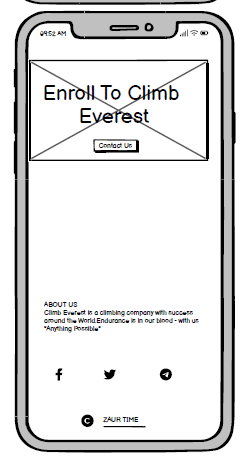
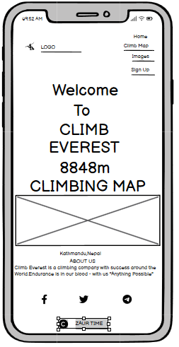
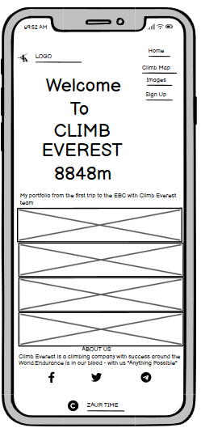
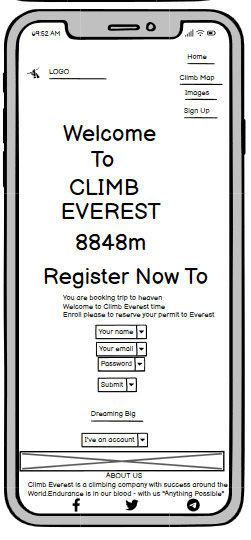

# CLIMB EVEREST 

Climb Everest is a website thats allows users to inspire do trekking in Nepal with a professional experienced team.This mystical journey may surprise you with its incredible views.Customers can choose the route to Mt.Everest depending on weather conditions and budget.The site also makes you dream and convince you that anything is possible.View alive [here](https://zaurtime.github.io/project1everest/index.html)

## Wireframes

### Desktop views :
 

Home page

Climb Map

Images

Sign Up

### Mobile views :

Home page

Climb Map

Images

Sign Up

## Features

### Site wide
* Navigation menu
  * Contains links to the Home, Climbing Map, Images and Sign Up pages and will be responsive on all devices.
  * This will allow users to easily navigate between the pages within the site on any size device. 

* Footer 
  * This will contain icons as links to our social media websites that will open in new tabs. Icons will be accessible to the visually impaired because specially made them larger than usual standart.
  * Under all pages copyright signiture year/name.
  
  
  
  ### Landing Page
 * Landing page image
    * This will show most significant path view pictures from real life trekking adventure to virtual world network.
    * This will help to immediately show the user what the website is about and help to animate the page.
    * As well its include call to action button "Are you ready,now?" wich is clickable and will allow the user to easily navigate to the registration form. 

 * Website information Climb Everest 
   *  Information about 'Climb Everest' and the websites purpose including an images of three ways to hike to the Everest base camp and climb Top of the world
    * This information lets the user know what the site is about
    
    
  * Information about office locations accros the world if clients decide to pay by cash and make sure company Climb Everest is real.

 * First office based in the United Arab Emirates,Dubai city
 
 * Second office location in Ukraine,Kyiv city
 

 * Third one main office in Ireland,Dublin city

* Enroll call for visitors of our website to register their interest and take their contact details.Additionally added a motivational bacground with mount Everest peak.
  * Contact Us is an active button takes you to the sign up page for future assistance.

* About Us
  * About Us shortly describes our company purpose and our core value about "Anything Possible".Specially short introduction to keep client interest to learn more about us on social media links wich are directly bellow and webpages inside site.
  

### Climbing Map
* Climbing Map pages always changes because depending on the weather condition.Currently one way right.

### Images
* Gallery where customers can see what to expect on the trip.You can see for example bellow

### Sign Up
* Sign Up pages brings you closer to your dream conquer Everest.Register card its first step to complete.We promisse to our clients reserve permit to the TOP. The form will consist of the following fields and attributes:

* Sign Up page have reverse card if you click "I've an account".This means we have clients already and for existing customers it will be pleasant we remeber them.The next form will consist of the following fields and attributes:

* Submit button in Register card after all required filled will show customers that we recived and if urgently need Climb Everest they can call immediately,check please example bellow:

* Submit button in Login card after all required filled will show customers that we greeting them back with name in our system and if they need urgently Climb Everest again and climbing different ways can call on hot line,check please example bellow:

## Testing
* Website is responsive on all screen sizes and no images are pixelated or stretched. No horizontal scroll is present. No elements overlap.

Actual:

Website behaved as expected with the 
Website was also opened on the following devices and no responsive issues were seen:
   * Iphone SE
   * Iphone 11
   * Samsung Galaxy A51
   * Samsung Galaxy A71
   * Laptop Lenovo ThinkPad T460
   * MacBook PRO M1 14 (2021)

## Accessibility
 * Testing was focused to ensure the following criteria were met:

- All forms have associated labels or aria-labels so that this is read out on a screen reader to users who tab to form inputs
- Color contrasts meet a minimum ratio as specified in [WCAG 2.1 Contrast Guidelines](https://www.w3.org/WAI/WCAG21/Understanding/contrast-minimum.html)
- Heading levels are not missed or skipped to ensure the importance of content is relayed correctly to the end user
- All content is contained within landmarks to ensure ease of use for assistive technology, allowing the user to navigate by page regions
- All not textual content had alternative text or titles so descriptions are read out to screen readers
- HTML page lang attribute has been set
- Aria properties have been implemented correctly
- WCAG 2.1 Coding best practices being followed

Manual tests were also performed to ensure the website was accessible as possible and an accessibility issue was identified.

### Lighthouse Testing
  * Desktop test 

  * Mobile test 

### W3C Validation Testing
 * html no errors 

 * css no errors 
 

### Deployment to Github Pages

- The site was deployed to GitHub pages. The steps to deploy are as follows: 
  - In the GitHub repository, navigate to the Settings tab 
  - From the menu on left select 'Pages'
  - From the source section drop-down menu, select the Branch: main
  - Click 'Save'
  - A live link will be displayed in a green banner when published successfully. 

### Clone the Repository Code Locally

Navigate to the GitHub Repository you want to clone to use locally:

- Click on the code drop down button
- Click on HTTPS
- Copy the repository link to the clipboard
- Open your IDE of choice (git must be installed for the next steps)
- Type git clone copied-git-url into the IDE terminal

The project will now of been cloned on your local machine for use.

## Credits 

* Code Institute  https://learn.codeinstitute.net/ci_program/diplomainsoftwaredevelopmentecomm

* Youtube https://www.youtube.com/watch?v=KhGWbt1dAKQ&t=365s

* Mentor Mr.Gareth McGirr

### Content 

All content listed in the Media section of this document.Permission was granted from free stock images.

* The icons in the footer were taken from Font Awesome

### Media
* Used their jpg map images in Climbing map page.
https://excitingnepal.com/

 https://shutterstock.com/ * Used their images in Images page 

### Unfixed Bugs

* No bugs all fixed.

